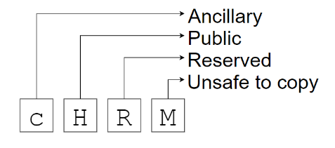
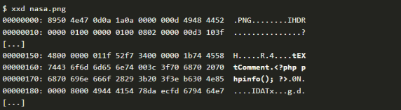
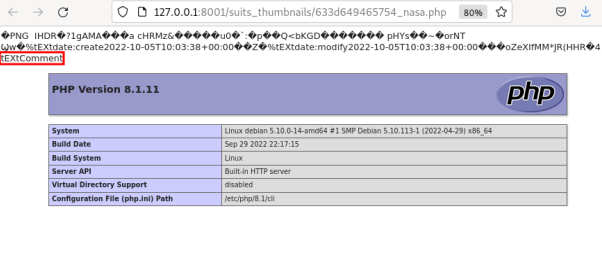

# Les fichiers PNG et les chunks

Le but de ce challenge était de lister tous les chunks d'un fichier PNG donné et d'en donner les caractéristiques. Mais tout d'abord, avant de débuter par le comment commençons par le pourquoi.

Qu'est-ce que des "chunks" ? Et comment les lister ? C'est ce que nous allons voir...

<br>

## Un fichier PNG mais encore ?

Un fichier PNG (Portable Network Graphic) est un format de fichier d’image pixellisé et une suite de blocs ou « chunks», chacun de ces chunk est composé :

* d’une taille de 4 octets
* d’un nom de 4 octets
* des données
* d’un CRC (checksum) de 4 octets

<br>

## Mais c'est quoi un chunk ?

Un chunk est une section ou catégorie qui définit une partie du fichier PNG (taille, couleur...). Exemple, le chunk IEND indique la fin du fichier : *00 00 00 00 49 45 4E 44 AE 42 60 82*.  

Le nom de ces chunks a une structure particulière et la capitalisation des lettres à un rôle à jouer :

|            | Majuscule        | Minuscule    |                                                                                                                                  |
|------------|------------------|--------------|----------------------------------------------------------------------------------------------------------------------------------|
| 1er octet  | Critique         | Auxiliaire   | Ce chunk est-il requis pour afficher l'image correctement ?                                                                      |
| 2ème octet | Publique         | Privé        | Est-ce un chunk privé ?                                                                                                          |
| 3ème octet | Réservé          | Réservé      | -                                                                                                                                |
| 4ème octet | Pas sûr à copier | Sûr à copier | Autorisation pour les logiciels éditeurs de fichiers PNG, si non, celui-ci doit refuser le traitement et faire un rapport de bug |


  

<br>

## De quoi est composé un chunk ?

Il est composé de quatres parties distinctes :  

• La **taille de la donnée stockée** dans celui-ci (sur 4 octets)  
• Le **type** de chunk : son nom (sur 4 octets)  
• Les **données** contenues dans le chunk  
• Le **CRC** (Cyclic Redundancy Check) calculé à l’aide d’un algorithme. Cette valeur calculée sert à déterminer s’il y a eu des erreurs lors de la transmission. Elle s’appuie sur les valeurs précédentes du chunk : les **données** et le **type**.

Pour illustrer mes propos, je vous propose de regarder en détails sur une image :

<br>
<div style="text-align: center">
    
</div>

Si nous examinons notre image via un lecteur hexadecimal, voilà à quoi elle ressemble :

```sh
0x89, 0x50, 0x4E, 0x47, 0x0D, 0x0A, 0x1A, 0x0A, 0x00, 0x00, 0x00, 0x0D, 0x49, 0x48, 0x44, 0x52, 
0x00, 0x00, 0x03, 0x86, 0x00, 0x00, 0x03, 0x22, 0x08, 0x03, 0x00, 0x00, 0x00, 0x05, 0x20, 0x2D, 
0xC7, 0x00, 0x00, 0x00, 0x04, 0x67, 0x41, 0x4D, 0x41, 0x00, 0x00, 0xB1, 0x8F, 0x0B, 0xFC, 0x61, 
0x05, 0x00, 0x00, 0x00, 0x01, 0x73, 0x52, 0x47, 0x42, 0x00, 0xAE, 0xCE, 0x1C, 0xE9, 0x00, 0x00, [...] 
```

Sympa non ?

Nous pouvons extraire depuis ce format, les chunks que nous souhaitons. Pour mon exemple, je vais prendre le chunk gAMA :

```sh
0x00, 0x00, 0x00, 0x04, 0x67, 0x41, 0x4D, 0x41, 0x00, 0x00, 0xB1, 0x8F, 0x0B, 0xFC, 0x61, 0x05
```

```txt
0x00, 0x00, 0x00, 0x04 : Taille de la donnée contenue dans le chunk (4 octets)

0x67, 0x41, 0x4D, 0x41 : Nom du chunk (gAMA)

0x00, 0x00, 0xB1, 0x8F : Données

0x0B, 0xFC, 0x61, 0x05 : CRC du chunk complet
```

Le checksum est calculé avec le type de chunk et la donnée de ce chunk, c’est pourquoi on passe en paramètre l’hexadécimal *67 41 4D 41 00 00 B1 8F*.  

Après calcul on obtient bien : *0B FC 61 05*.

<br>

## Quels types de chunk ?

Un fichier PNG contient **deux types de chunks** : les chunks **auxiliaires** (ancillary chunks) et les chunks **critiques** (critical chunks). Lorsque l’on compresse une image PNG, les chunks auxiliaires sont **détruits** afin de réduire la taille du fichier.  

Pour qu’une image PNG soit valide elle doit au minimum contenir ces 3 chunks :  

• **IHDR** : Chunk principal de l’image, il permet de définir les aspects de celle-ci comme la hauteur, la largeur, la méthode de compression, de filtre, s’il y a de l’entrelacement...  
• **IDAT** : Contient les données compressées relatives au contenu de l’image, il se présente sous la forme de données compressées avec ZLIB.  
• **IEND** : Ce chunk indique la fin du fichier PNG.  

Il existe bien d’autres chunks allant de la palette de couleurs au commentaire internationaux, en voici quelques-un :  

• bKGD : Pour background color, ce chunk permet de définir une couleur d’arrière-plan au cas où des parties soient transparentes  
• gAMA : définit le gamma de l’image  
• PLTE : Définit la palette de couleurs RGB utilisée, 255 valeurs par couleur  
• tEXt : Chunk de texte  
• tIME : définit la date de la dernière modification  
• ...  

Pour plus d’informations sur les types de chunks : http://www.libpng.org/pub/png/spec/1.2/PNG-Chunks.html

<br>

## Quels sont les risques et vulnérabilités ?

Les chunks des fichiers PNG sont aussi une porte d'entrée pour tout type d'attaque. En effet, certains de ces chunks permettent notamment de réaliser des injections de code malveillant. Si l’on prend l’exemple d’un serveur web PHP où serait stockée des images PNG, il serait fortement possible de corrompre des chunks sur des images PNG uploadés et de les utiliser ensuite.

Exemple d’une commande PHP injectée dans le chunk **tEXt** qui est ensuite exploitée en renommant le fichier *nasa.png* en *nasa.php*, puis uploadée sur le serveur.

<br>
<div style="text-align: center">
    
    <br/>
    <br/>
    
</div>  
<br>

Les méthodes de compressions d’images permettraient de réduire certaines attaques puisqu’elles détruisent les chunk auxiliaires et donc déduisent un pourcentage de risques. Cependant, certains chunks critiques peuvent aussi être corrompus tel que le bloc IDAT.  

En utilisant des méthodes assez complexe, il est très bien possible d'utiliser le principe de traitement et de compression des blocs IDAT. En effet, en trouvant une combinaison précise de pixels bruts, qui une fois traitée par les filtres et compressée par l'algorithme DEFLATE, peut générée une charge utile.

Ce chunk IDAT (très volumineux) peut aussi être source de DoS (Denial of Service) si le système ne gère pas correctement la lecture de ce bloc.  

Pour finir, évidemment les vulnérabilités "0-Day" avec des vulnérabilités non-documentée et non-répertoriée.

<br>

# Challenge


Ecrire un script python qui prend en argument le chemin vers un fichier PNG et liste les « chunks » contenus dans le fichier. Pour chaque chunk, donner le type, la taille, l’entropie (des data du chunk) et le CRC32 (lu et calculé) : “type, size, CRC, CRC_ref, entropy”.

Pré-requis :

* Python 3 >
* Numpy

```sh

python3.10 chunk_explorer.py ./assets/bob.png

./assets/bob.png
('IHDR', 13, '0x5202dc7', '0x5202dc7', 0.2846)
('gAMA', 4, '0xbfc6105', '0xbfc6105', 0.5)
('sRGB', 1, '0xaece1ce9', '0xaece1ce9', -0.0)
('PLTE', 768, '0x765a083b', '0x765a083b', 0.0125)
('tRNS', 1, '0x40e6d866', '0x40e6d866', -0.0)
('IDAT', 8192, '0xaa647646', '0xaa647646', 0.0016)
('IDAT', 8192, '0x7a5cdd3c', '0x7a5cdd3c', 0.0016)
('IDAT', 8192, '0x74711699', '0x74711699', 0.0016)
('IDAT', 7335, '0x1f5b3b25', '0x1f5b3b25', 0.0018)
('IEND', 0, '0xae426082', '0xae426082', 0)

```